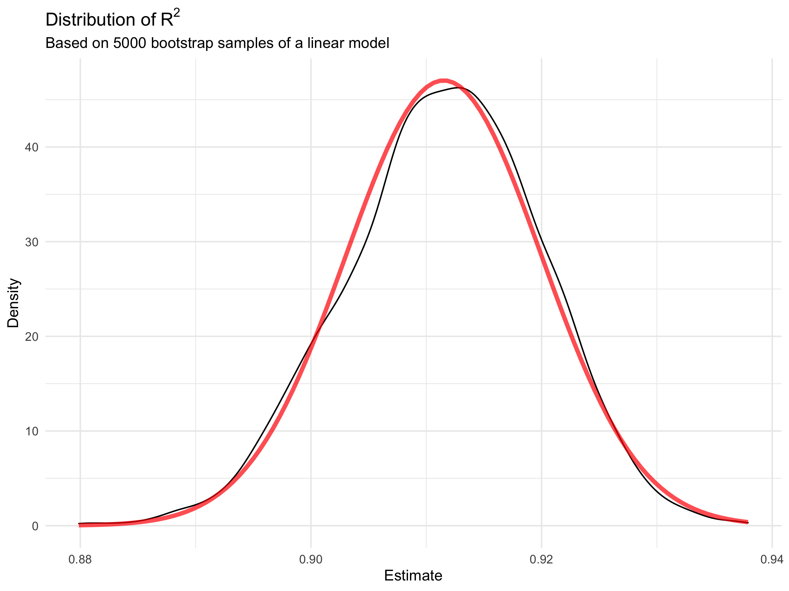
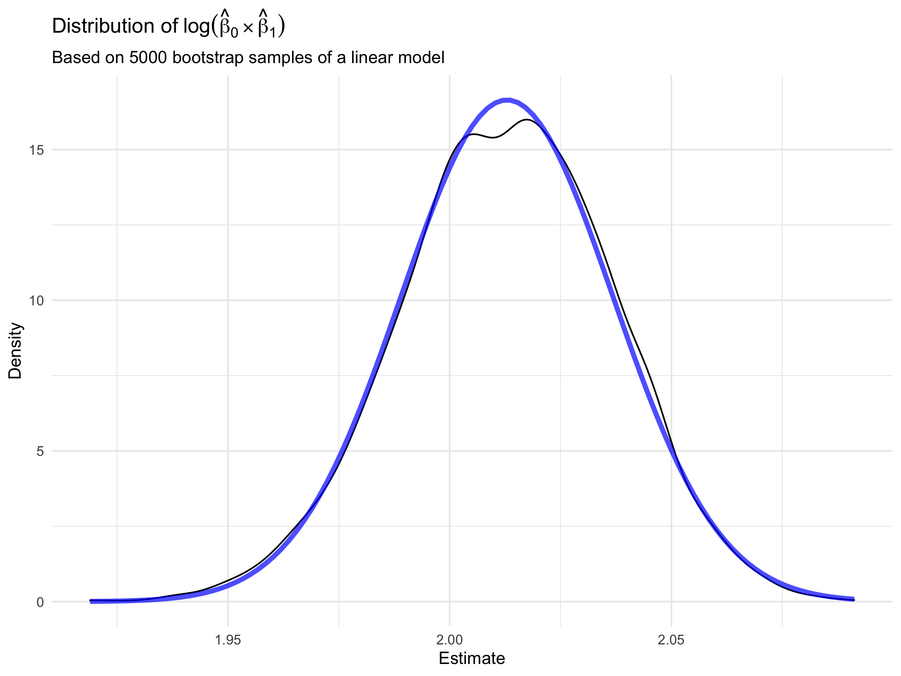

p8105\_hw6\_jys2137
================
jys2137
12/4/2021

### Problem 1

In this problem, we analyze data gathered to understand the effects of
several variables on a child’s birthweight. The `birthweight` dataset
consists of roughly 4000 children and includes the following variables:

#### 1.1. Loading and cleaning the data

First, we load and clean the data in preparation for regression
analysis. We do this by:

-   converting ***numeric*** variables to ***factor*** (for `babysex`,
    `frace`, `malform`, and `mrace`)
-   converting **imperial** variable measurements to **metric** for
    consistency (weight from pounds to grams, height from inches to
    centimeters).
-   checking for **missing data**

``` r
birthweight_df = read_csv("data/birthweight.csv") %>% 
  janitor::clean_names() %>%
  mutate(
    babysex = as.factor(babysex),
    babysex = fct_recode(babysex, "male" = "1", "female" = "2"),
    frace = as.factor(frace),
    frace = fct_recode(frace, "white" = "1", "black" = "2", "asian" = "3", 
                       "puerto rican" = "4", "other" = "8"),
    mrace = as.factor(mrace),
    mrace = fct_recode(mrace, "white" = "1", "black" = "2", "asian" = "3", 
                       "puerto rican" = "4"),
    malform = as.factor(malform),
    malform = fct_recode(malform, "absent" = "0", "present" = "1"),
    delwt_g = delwt * 453.59237,
    mheight_cm = mheight * 2.54,
    ppwt_g = ppwt * 453.59237,
    wtgain_g = wtgain * 453.59237)
```

    ## Rows: 4342 Columns: 20

    ## ── Column specification ────────────────────────────────────────────────────────
    ## Delimiter: ","
    ## dbl (20): babysex, bhead, blength, bwt, delwt, fincome, frace, gaweeks, malf...

    ## 
    ## ℹ Use `spec()` to retrieve the full column specification for this data.
    ## ℹ Specify the column types or set `show_col_types = FALSE` to quiet this message.

``` r
sum(is.na(birthweight_df))
```

    ## [1] 0

Note that in our check for missing data, we can see that there are **no
`NA` observations** in the data frame.

### Problem 2

For this problem, we explore boostrapping by using weather data from
NOAA that involves the `minimum` and `maximum` temperatures for Central
Park in 2017.

#### 2.1. Loading the data

The code chunk below loads the weather dataset.

``` r
weather_df = 
  rnoaa::meteo_pull_monitors(
    c("USW00094728"),
    var = c("PRCP", "TMIN", "TMAX"), 
    date_min = "2017-01-01",
    date_max = "2017-12-31") %>%
  mutate(
    name = recode(id, USW00094728 = "CentralPark_NY"),
    tmin = tmin / 10,
    tmax = tmax / 10) %>%
  select(name, id, everything())
```

    ## Registered S3 method overwritten by 'hoardr':
    ##   method           from
    ##   print.cache_info httr

    ## using cached file: ~/Library/Caches/R/noaa_ghcnd/USW00094728.dly

    ## date created (size, mb): 2021-12-04 01:44:20 (7.616)

    ## file min/max dates: 1869-01-01 / 2021-12-31

#### 2.2. Bootstrap

Now, we focus on a simple linear regression and are interested in the
distribution of two quantities estimated from these data:

1.  *r̂*<sup>2</sup>
2.  log (*β*<sub>0</sub> \* *β*1)

We will use 5000 bootstrap samples from the `weather_df` data frame. For
each sample, we fit a simple linear regression with `tmax` as the
response and `tmin` as the predictor.

The chunk below sets the bootstraps up. We use `broom::glance()` for
getting *r̂*<sup>2</sup> and `broom::tidy()` for getting
log (*β*<sub>0</sub> \* *β*<sub>1</sub>) from the fitted regression.

``` r
set.seed(123)

boot_strap =
  weather_df %>% 
  modelr::bootstrap(n = 5000) %>%
  mutate(
    models = map(strap, ~lm(tmax ~ tmin, data = .x)),
    results = map(models, broom::tidy),
    glance = map(models, broom::glance)) %>% 
  select(-strap, -models) %>% 
  unnest(results, glance) %>% 
  select(.id, term, estimate, r.squared) %>% 
  pivot_wider(
    names_from = term,
    values_from = estimate) %>% 
  rename(
    beta0 = `(Intercept)`,
    beta1 = tmin) %>% 
  mutate(log_b0b1 = log(beta0 * beta1)) %>% 
  select(r.squared, log_b0b1)
```

##### 2.3. Estimate *r̂*<sup>2</sup>

To plot the distribution of the estimates of *r̂*<sup>2</sup>, we use the
following code chunk.

``` r
boot_strap %>% 
  ggplot(aes(x = r.squared)) + 
  geom_density(alpha = 0.2) +
  stat_function(fun = dnorm,
                args = with(boot_strap, c(mean = mean(r.squared), sd = sd(r.squared))),
                color = "red",
                size = 1.5,
                alpha = .7) +
  theme(legend.position = "none") +
  labs(
        title = "Distribution of" ~R^2, 
        subtitle = "Based on 5000 bootstrap samples of a linear model",
        x = "Estimate",
        y = "Density")
```



The estimates for ***r̂*<sup>2</sup>** looks to be roughly **normally
distributed**. However, it is important to note that the estimate is
high, as the values are distributed closer to the upper bound of 1. It
could be argued that there is a very slight left-skew in the
distribution, but this is likely due to the high estimate of
*r̂*<sup>2</sup>. This suggests that a vast majority of the variation in
`tmax` can be explained by `tmin`.

##### 2.4. Estimate for log (*β*<sub>0</sub> \* *β*<sub>1</sub>)

Similarly, we plot the distribution of the estimates of
log (*β*<sub>0</sub> \* *β*<sub>1</sub>), using the code chunk below.
Note that we need to do some more data wrangling for this plot.

``` r
boot_strap %>% 
  ggplot(aes(x = log_b0b1)) + 
  geom_density(alpha = 0.2) +
  stat_function(fun = dnorm,
                args = with(boot_strap, c(mean = mean(log_b0b1), sd = sd(log_b0b1))),
                color = "blue",
                size = 1.5,
                alpha = .7) +
  theme(legend.position = "none") +
  labs(
        title = "Distribution of" ~log(hat(beta)[0] %*% hat(beta)[1]),
        subtitle = "Based on 5000 bootstrap samples of a linear model",
        x = "Estimate",
        y = "Density")
```



Similar to the ***r̂*<sup>2</sup>** estimate, the distribution for
**log (*β*<sub>0</sub> \* *β*<sub>1</sub>)** is also roughly **normally
distributed**. However, the plot shows that the **peak** of this
distribution is not exactly normal as it has a *very small dip* at the
top of the distribution.

#### 2.5. 95% Confidence Intervals

Using the 5000 bootstrap estimates, we can identify the 2.5% and 97.5%
quantiles to provide a **95% confidence interval** for
***r̂*<sup>2</sup>** and **log (*β*<sub>0</sub> \* *β*<sub>1</sub>)**.

-   The *95% confidence interval* of **`R-squared`** is (0.89, 0.93).

-   The *95% confidence interval* of **`log(beta0 x beta1)`** is (1.96,
    2.06).

The code chunk below produces a useful table with point estimates and
confidence intervals or *r̂*<sup>2</sup> and
log (*β*<sub>0</sub> \* *β*<sub>1</sub>).

``` r
# Get estimate and confidence interval for each term
tibble(term = c("R-Squared", "Log Product"),
       Estimate = c(mean(pull(boot_strap, r.squared)),
                    mean(pull(boot_strap, log_b0b1))),
       "Lower CI" = c(quantile(pull(boot_strap, r.squared), 0.025),
                    quantile(pull(boot_strap, log_b0b1), 0.025)),
       "Upper CI" = c(quantile(pull(boot_strap, r.squared), 0.975),
                    quantile(pull(boot_strap, log_b0b1), 0.975))) %>%
  knitr::kable()
```

| term        |  Estimate |  Lower CI |  Upper CI |
|:------------|----------:|----------:|----------:|
| R-Squared   | 0.9115107 | 0.8945701 | 0.9271042 |
| Log Product | 2.0129216 | 1.9641656 | 2.0583636 |
